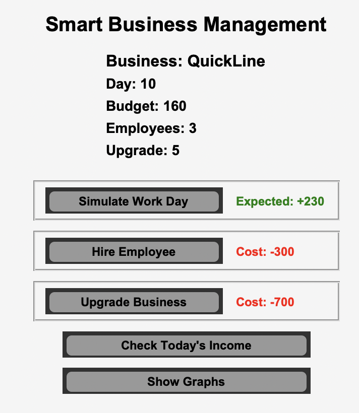
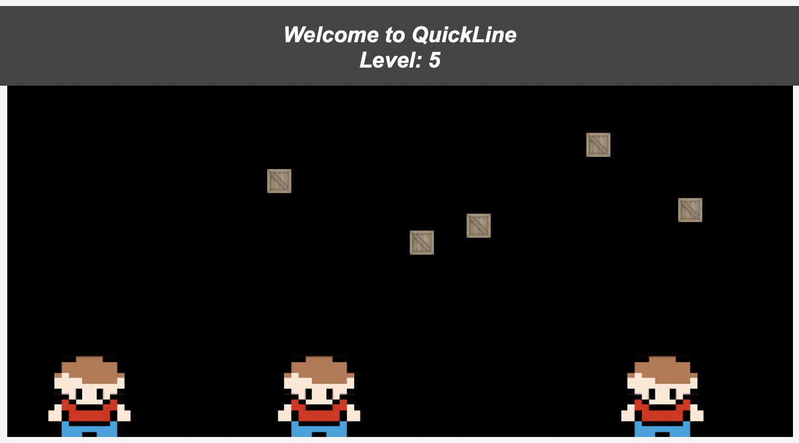

# Business Tycoon - Project Management

## Overview

Business Tycoon is a Python simulation game where you manage a small business. Hire employees, upgrade your business, simulate work days, and analyze financial data using Tkinter, pandas, and matplotlib.

## Features

- **Simulation:** Daily calculation of income, expenses, and profit.
- **Employee Management:** Hire employees (cost: 300 each) with animated worker sprites moving in the shop area.
- **Business Upgrades:** Increase your upgrade level to improve performance and add decorative boxes (20×20) in the shop area.
- **Data Analysis:** View graphs for daily profit, cumulative profit, and income vs expense.

## Screenshots

Below are some screenshots demonstrating key parts of the application. The screenshots are stored in a folder named `readmeImage`.

1. **Registration Screen**  
     
   _This screenshot shows the prompt where the user enters their business name upon startup._

2. **Main User Interface**  
     
   _This screenshot displays the main interface with status, actions, and the shop area where workers move._

3. **Business View**  
     
   _This screenshot provides a closer look at the shop area, showing moving worker sprites and decorative boxes._

## Project Structure

- **app.py** – Main game script.
- **worker.png** – Employee image (resized to 80×80).
- **box.png** – Decorative box image (resized to 20×20).
- **readmeImage/** – Folder containing screenshots.
- **README.md** – This file.

## Installation & Running

1. **Clone the Repository:**  
   Download or clone the project files into your local directory.
2. **Install Dependencies:**  
   Run the following command:

   ```bash
   pip3 install pillow pandas matplotlib
   ```

3. **Verify Files:**  
   Ensure that both `worker.png` and `box.png` are located in the same directory as `app.py`.

4. **Run the Application:**  
   In your terminal, navigate to your project directory and execute:
   ```bash
   python3 app.py
   ```

## License

This project is licensed under the MIT License.

## Acknowledgments

Developed as an advanced Python simulation combining GUI programming, data analysis, and visualization.
